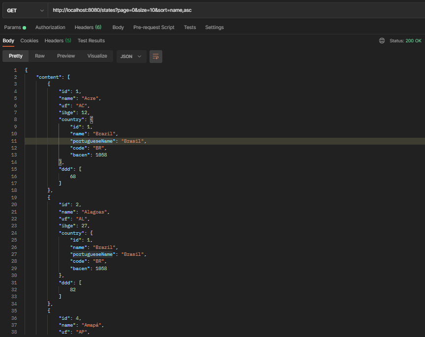
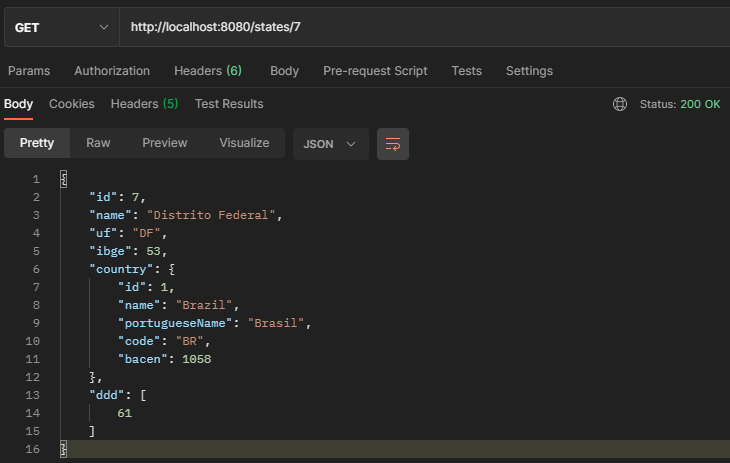
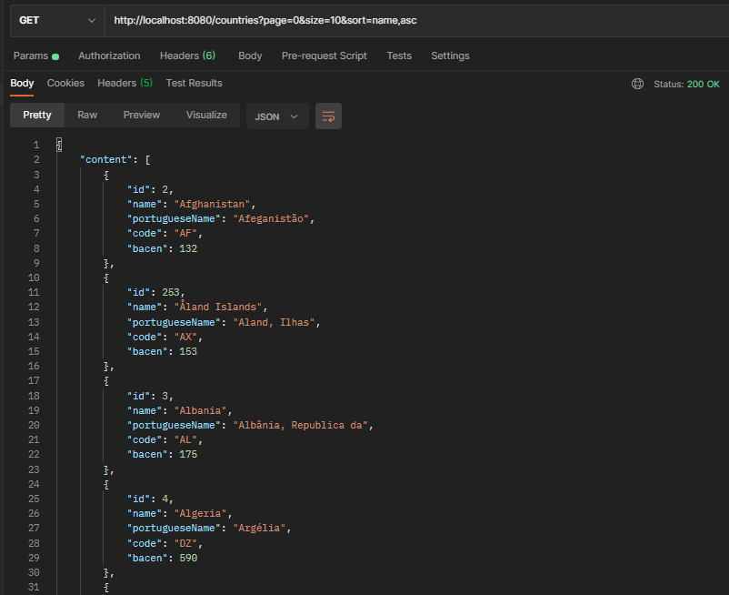
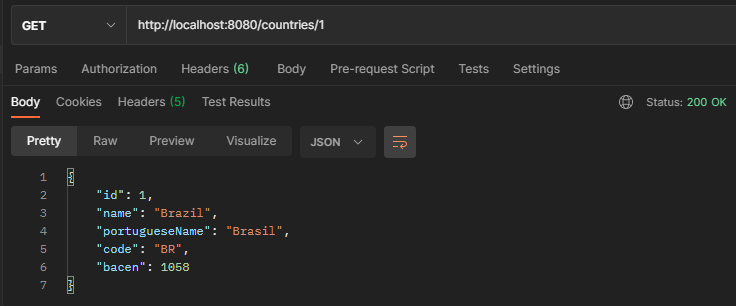
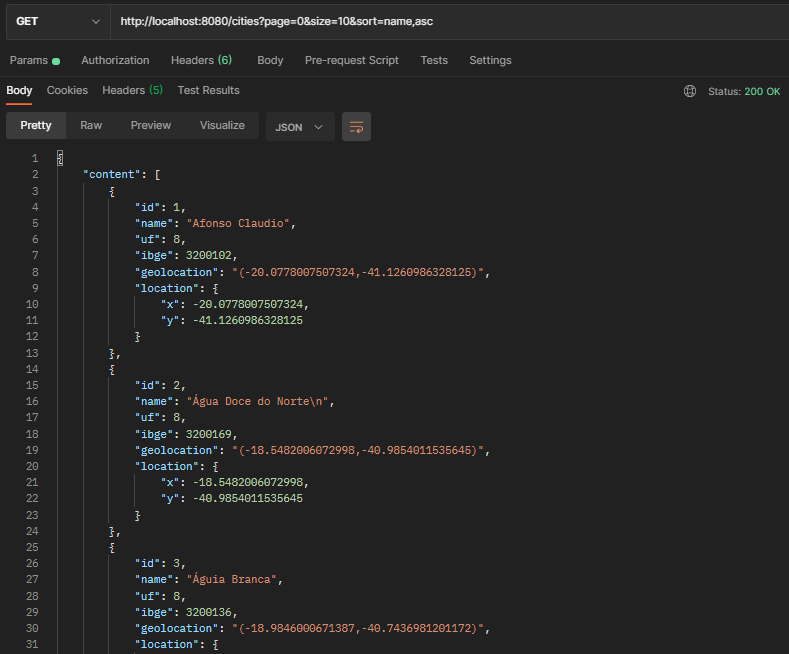
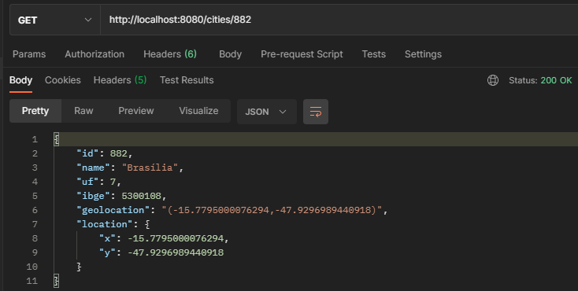
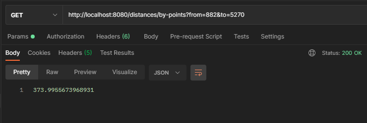
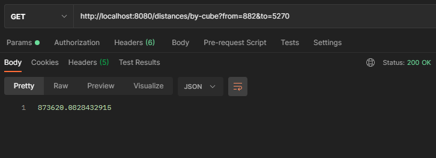
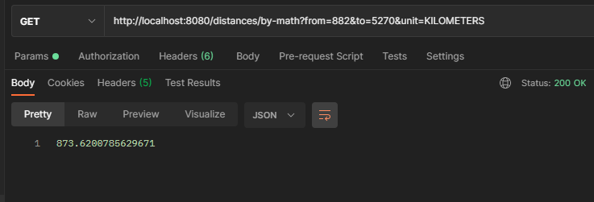

<p align="center">
  
</p>

<p align="center">
  <a href="#about">About</a>&nbsp;&nbsp;&nbsp;|&nbsp;&nbsp;&nbsp;
  <a href="#preview">Preview</a>&nbsp;&nbsp;&nbsp;|&nbsp;&nbsp;&nbsp;
  <a href="#technologies">Technologies</a>&nbsp;&nbsp;&nbsp;|&nbsp;&nbsp;&nbsp;
  <a href="#preparing">Preparing</a>&nbsp;&nbsp;&nbsp;|&nbsp;&nbsp;&nbsp;
  <a href="#building">Building</a>&nbsp;&nbsp;&nbsp;|&nbsp;&nbsp;&nbsp;
  <a href="#contributing">Contributing</a>&nbsp;&nbsp;&nbsp;
</p>

## About
<strong>Cities API</strong> is an API for querying cities, states and countries, in addition to allowing you to calculate the distance between two cities, and returns the distance in the desired unit.

## Preview
#### State Methods
```
http://localhost:8080/states

or

http://localhost:8080/states?page={pageNumber}&size={pageSize}&sort={sortType}
```
<p align="center">
  
</p>


```
http://localhost:8080/states/{stateId}
```
<p align="center">
  
</p>

<br/>

#### Country Methods
```
http://localhost:8080/countries

or

http://localhost:8080/countries?page={pageNumber}&size={pageSize}&sort={sortType}
```
<p align="center">
  
</p>

```
http://localhost:8080/countries/{countryId}
```
<p align="center">
  
</p>

<br/>

#### City Methods
```
http://localhost:8080/cities

or

http://localhost:8080/cities?page={pageNumber}&size={pageSize}&sort={sortType}
```
<p align="center">
  
</p>

```
http://localhost:8080/cities/{cityId}
```
<p align="center">
  
</p>

<br/>

#### Distance Methods
```
http://localhost:8080/distances/by-points?from={cityId}&to={cityId}
```
<p align="center">
  
</p>

```
http://localhost:8080/distances/by-cube?from={cityId}&to={cityId}
```
<p align="center">
  
</p>

```
http://localhost:8080/distances/by-math?from={cityId}&to={cityId}&unit={unitType}
```
<p align="center">
  
</p>


## Technologies
This project was developed using the following technologies:
- [Spring](https://spring.io/)
- [Java](https://www.oracle.com/br/java/technologies/javase-jdk11-downloads.html)
- [JPA + Hibernate](https://spring.io/projects/spring-data-jpa)
- [Postgres](https://www.postgresql.org/)


## Preparing
### Populate Database
All files are in the datasql folder or you can download the files from the [Official Repository](https://github.com/chinnonsantos/sql-paises-estados-cidades/tree/master/PostgreSQL).
Import the data into your bank manually. 

If you use docker:
```bash
docker run --name cities-db -d -p 5432:5432 -e POSTGRES_USER=postgres_user_city -e POSTGRES_PASSWORD=super_password -e POSTGRES_DB=cities postgres

docker run -it --rm --net=host -v $PWD:/tmp postgres /bin/bash

psql -h localhost -U postgres_user_city cities -f /tmp/pais.sql
psql -h localhost -U postgres_user_city cities -f /tmp/estado.sql
psql -h localhost -U postgres_user_city cities -f /tmp/cidade.sql

psql -h localhost -U postgres_user_city cities
```

Then enable extensions in postgres
```
CREATE EXTENSION cube; 
CREATE EXTENSION earthdistance;
```

References
* [Postgres Earth Distance](https://www.postgresql.org/docs/current/earthdistance.html)
* [Postgres Doc: earthdistance--1.0--1.1.sql](https://github.com/postgres/postgres/blob/master/contrib/earthdistance/earthdistance--1.0--1.1.sql)
* [OPERATOR <@>](https://github.com/postgres/postgres/blob/master/contrib/earthdistance/earthdistance--1.1.sql)
* [Postgrescheatsheet](https://postgrescheatsheet.com/#/tables)
* [Datatype-geometric](https://www.postgresql.org/docs/current/datatype-geometric.html)

### Access

```bash
docker exec -it cities-db /bin/bash

psql -U postgres_user_city cities
```

### Query Earth Distance

Point
```roomsql
select ((select lat_lon from cidade where id = 882) <@> (select lat_lon from cidade where id=5270)) as distance;
```

Cube
```roomsql
select earth_distance(
    ll_to_earth(-21.95840072631836,-47.98820114135742), 
    ll_to_earth(-22.01740074157715,-47.88600158691406)
) as distance;
```

## Building
You'll need [Java 11+](https://www.oracle.com/br/java/technologies/javase-jdk11-downloads.html) and [Maven](https://maven.apache.org/download.cgi) installed on your computer in order to build this app.
```bash
$ git clone https://github.com/eric-souzams/cities-distance-api.git
$ cd /cities-distance-api
$ mvn spring-boot:run
```


## Contributing
This repository is currently under development. If you want to contribute please fork the repository and get your hands dirty, and make the changes as you'd like and submit the Pull request.